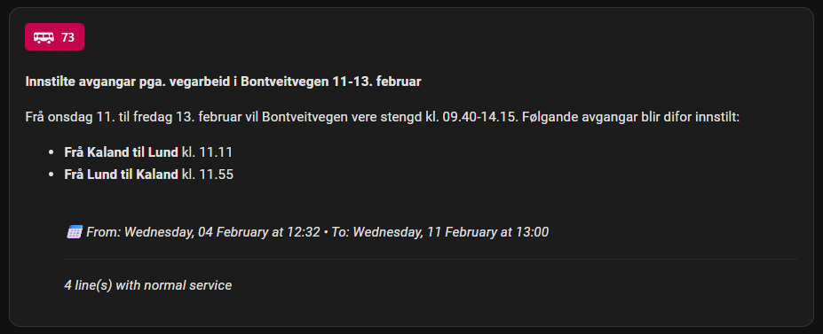

# Entur Situation Exchange Custom Integration

[![hacs][hacs-badge]][hacs-url]
[![Validate with HACS][hacs-validation-badge]][hacs-validation-url]
[![release][release-badge]][release-url]
![Maintenance][maintenance-badge]
![GitHub Downloads (all assets, all releases)][downloads-total]
![GitHub Downloads (all assets, latest release)][downloads-latest]

Stay ahead of transport delays and disruptions across Norway! This Home Assistant custom integration monitors real-time service deviations from Entur.no, alerting you to delays, cancellations, and route changes on your regular transit lines.

**Key Features:**
- 🎨 **Beautiful Entur TravelTag badges** with transport mode icons (bus, train, tram, metro, ferry, etc.)
- 📊 **Summary sensors** with numeric disruption counts for easy card visibility control
- 🌍 **Automatic language support** (Norwegian/English) based on your Home Assistant settings
- 📱 **Rich markdown formatting** with locale-aware dates and professional styling

Get instant updates through dedicated sensors for each monitored line, showing current service status with authentic Entur Design System styling. 


## What is Entur Situation Exchange?

Entur is a Norwegian government-owned company that operates the national public transport travel planner and sales system, sharing data with anyone who wants it, for free under the NLOD license. The situation-exchange service provides real-time information about service disruptions, delays, and deviations for public transport across Norway. This integration monitors specific transit lines and alerts you when there are issues affecting your regular routes.

Example status message:



With this integration you can create sensors for just the routes you are interested in monitoring. This is useful if you use the same routes regularly and want a quick update before you leave your home, or you can get a notification on your mobile device.


## Installation

### Installation with HACS (Recommended)

1. Open HACS in your Home Assistant instance
2. Click on "Integrations"
3. Click the three dots in the top right corner
4. Select "Custom repositories"
5. Add the URL: `https://github.com/DTekNO/ha-entur_sx`
6. Select category: "Integration"
7. Click "Add"
8. Search for "Entur Situation Exchange" in HACS
9. Click "Download"
10. Restart Home Assistant

### Manual Installation

1. Copy the `custom_components/entur_sx` folder to your Home Assistant `custom_components` directory
2. Restart Home Assistant

## Configuration

After installation, add the integration through the Home Assistant UI:

1. Go to **Settings** → **Devices & Services**
2. Click **+ Add Integration**
3. Search for "Entur Situation Exchange"
4. Follow the configuration wizard:

### Step 1: Device Name
   - **Device name**: A descriptive name for this collection of lines (e.g., "Skyss Disruption" or "My Daily Commute")

### Step 2: Select Operator
   - Choose from a list of all Norwegian public transport operators
   - Shows both the operator code (e.g., SKY) and friendly name (e.g., Skyss)
   - Common operators:
     - **SKY** - Skyss (Bergen area)
     - **RUT** - Ruter (Oslo area)
     - **ATB** - AtB (Trondheim area)
     - **KOL** - Kolumbus (Stavanger area)
     - And many more...

### Step 3: Select Lines
   - Choose one or more lines to monitor
   - Shows line numbers with route names and transport mode
   - Example: "1 - Bergen lufthavn Flesland- Lagunen - Byparken (tram)"

The integration will create:
- One sensor for each selected line
- One summary sensor showing the total count of active disruptions (if enabled)

### Finding Line References

The config flow automatically:
- Fetches all available operators from Entur
- Shows operator codes and friendly names
- Fetches all lines for your selected operator
- Displays line numbers, names, and transport modes

You can add multiple monitoring devices for different operators or groups of lines by repeating the process.

## Use

### Line Sensors

The integration creates one sensor for each monitored line. Each sensor shows:

- **State**: The current status summary (e.g., "Normal service" or description of the deviation)
- **Entity Picture**: Automatically displays an Entur TravelTag-style badge with the transport mode icon and line number
- **Attributes**:
  - `status`: Current status - `open` (active now), `planned` (scheduled), or `expired` (ended)
  - `valid_from`: When the deviation started/starts (locale-formatted date/time)
  - `valid_to`: When the deviation ends (locale-formatted date/time, may be null)
  - `description`: Detailed description of the deviation
  - `progress`: Raw progress value from API (OPEN, CLOSED, etc.)
  - `line_ref`: The line reference
  - `formatted_content`: Markdown-formatted content with TravelTag badges (for markdown cards)
  - `all_deviations`: Array of all deviations if multiple exist
  - `total_deviations`: Count of all deviations
  - `deviations_by_status`: Count of deviations grouped by status

### Summary Sensor

If enabled, a summary sensor is created that aggregates all monitored lines:

- **State**: Numeric count of all disruptions (open + planned) - perfect for conditional card visibility
- **Attributes**:
  - `markdown_active`: Markdown with badges for all lines with active (open) disruptions only
  - `markdown_planned`: Markdown with badges for all lines with planned disruptions only
  - `active_disruptions`: Count of active (open) disruptions
  - `planned_disruptions`: Count of planned disruptions
  - `lines`: List of all monitored lines

The numeric state makes it easy to show/hide cards based on whether any disruptions exist.

### Display with Markdown Cards

#### Individual Line Disruptions

The integration provides a `formatted_content` attribute that displays disruptions as Entur-styled TravelTag badges:

```yaml
type: markdown
content: |
  {{ state_attr('sensor.skyss_disruption_sky_line_1', 'formatted_content') }}
```

#### Summary of All Active Disruptions

Use the summary sensor to show all active disruptions at once:

```yaml
type: conditional
conditions:
  - condition: numeric_state
    entity: sensor.skyss_disruption_summary
    above: 0
card:
  type: markdown
  content: |
    # 🚨 Active Transit Disruptions
    {{ state_attr('sensor.skyss_disruption_summary', 'markdown_active') }}
```

**Badge Features:**
- **Transport mode badges** with official Entur Design System colors and icons
  - 12 transport modes: bus, train, tram, ferry, metro, mobility, bicycle, walk, plane, helicopter, taxi, carferry
- **Line numbers** displayed in badges with proportional scaling
- **Disruption summaries and descriptions** with clean formatting
- **Validity periods** with locale-aware date formatting (Norwegian or English)
- Professional styling matching Entur's TravelTag design

## Features

- 🚌 **Monitor multiple transit lines** - Track unlimited lines across Norway
- 🔄 **Automatic updates** - Refreshes every 2 minutes
- 🌐 **All Norwegian operators** - Support for every public transport operator in Norway
- 🎨 **Entur TravelTag badges** - Beautiful badges with transport mode icons and official Entur colors
  - Entity pictures on line sensors
  - Markdown badges in formatted_content
  - 12 transport modes with authentic Entur Design System styling
- 📊 **Summary sensor** - Numeric count of total disruptions (open + planned) for easy card visibility control
- 🌍 **Language support** - Automatic Norwegian/English based on your Home Assistant language setting
  - Norwegian: "Fra: Mandag, 09. februar kl. 14:30"
  - English: "From: Monday, 09 February at 14:30"
- ⏰ **Status indicators** - Planned, open, or expired deviations
- 🕐 **Date/time formatting** - Locale-aware formatting for validity periods
- 💡 **Native HA integration** - No AppDaemon or MQTT required
- ✨ **Dynamic discovery** - Select operators and lines from dropdown lists, no manual code lookup
- 🎯 **Clean entity IDs** - Based on line references
- 🔍 **API redundancy** - Handles API changes gracefully
- 📝 **Disruption tracking log** - Optional detailed logging of when disruptions appear and disappear

## Disruption Tracking Log

The integration can maintain a detailed log of when disruptions appear and disappear from the Entur API. This is useful for:
- Tracking patterns in what disruptions are published to the API
- Comparing with operator websites to identify missing disruptions
- Monitoring the reliability of the data feed

### Enabling Disruption Logging

Add this to your `configuration.yaml`:

```yaml
logger:
  default: info
  logs:
    # Regular integration logs (optional - for debugging)
    custom_components.entur_sx: debug
    
    # Disruption tracking log (recommended)
    custom_components.entur_sx.coordinator.disruptions: info
```

Restart Home Assistant after making changes.

### Log Output

The disruption log will show entries like:

```
2025-12-06 20:15:00 INFO (MainThread) [custom_components.entur_sx.coordinator.disruptions] [2025-12-06 20:15:00] NEW disruption on SKY:Line:1 (status: open) - Det er forseinkingar på linja etter driftsst... - valid from: 2025-12-06T18:30:00+01:00

2025-12-06 21:45:00 INFO (MainThread) [custom_components.entur_sx.coordinator.disruptions] [2025-12-06 21:45:00] REMOVED disruption from SKY:Line:1 (was: open) - Det er forseinkingar på linja etter driftsst...
```

### Viewing the Log

**Option 1: Via Home Assistant UI**
1. Go to **Settings** → **System** → **Logs**
2. Filter by `custom_components.entur_sx.coordinator.disruptions`

**Option 2: In home-assistant.log file**
1. Open `/config/home-assistant.log`
2. Search for `custom_components.entur_sx.coordinator.disruptions`

**Option 3: Create a persistent log file** (recommended for long-term tracking)

Add to `configuration.yaml`:

```yaml
logger:
  default: info
  logs:
    custom_components.entur_sx.coordinator.disruptions: info
  filters:
    custom_components.entur_sx.coordinator.disruptions:
      - "/config/entur_sx_disruptions.log"
```

Note: The filters option requires Home Assistant 2023.4 or later. For older versions, the disruptions will only appear in the main `home-assistant.log` file.

> 💡 For details on API rate limiting, throttle handling, and database/recorder optimisation see [TECHNICAL_DETAILS.md](TECHNICAL_DETAILS.md).

## Example Dashboard Configuration

### Basic Status Card with Badges

Entity cards automatically show TravelTag badges as entity pictures:

```yaml
type: entities
title: Transit Status
entities:
  - entity: sensor.skyss_disruption_sky_line_1
  - entity: sensor.skyss_disruption_sky_line_2
  - entity: sensor.skyss_disruption_sky_line_20
```

### Summary Card - Show When Any Disruptions Exist

```yaml
type: conditional
conditions:
  - condition: numeric_state
    entity: sensor.skyss_disruption_summary
    above: 0
card:
  type: markdown
  title: 🚨 Transit Disruptions
  content: |
    {{ state_attr('sensor.skyss_disruption_summary', 'markdown_active') }}
    {{ state_attr('sensor.skyss_disruption_summary', 'markdown_planned') }}
```

### Summary Card - Active Disruptions Only

If you want to show only active disruptions:

```yaml
type: conditional
conditions:
  - condition: "{{ state_attr('sensor.skyss_disruption_summary', 'active_disruptions') > 0 }}"
card:
  type: markdown
  title: 🚨 Active Transit Disruptions
  content: |
    {{ state_attr('sensor.skyss_disruption_summary', 'markdown_active') }}
```

### Summary Card - Planned Disruptions Only

```yaml
type: conditional
conditions:
  - condition: template
    value_template: "{{ state_attr('sensor.skyss_disruption_summary', 'planned_disruptions') > 0 }}"
card:
  type: markdown
  title: 📅 Upcoming Disruptions
  content: |
    {{ state_attr('sensor.skyss_disruption_summary', 'markdown_planned') }}
```

### Individual Line Detail Card

```yaml
type: conditional
conditions:
  - condition: state
    entity: sensor.skyss_disruption_sky_line_1
    state_not: Normal service
card:
  type: markdown
  content: |
    {{ state_attr('sensor.skyss_disruption_sky_line_1', 'formatted_content') }}
```

### Show Only Active (Open) Deviations

```yaml
type: conditional
conditions:
  - condition: template
    value_template: "{{ state_attr('sensor.skyss_disruption_sky_line_1', 'status') == 'open' }}"
card:
  type: markdown
  content: |
    ## 🚨 Active Deviation on Line 1
    {{ state_attr('sensor.skyss_disruption_sky_line_1', 'formatted_content') }}
```

### Glance Card with Multiple Lines

```yaml
type: glance
title: My Transit Lines
entities:
  - entity: sensor.skyss_disruption_sky_line_1
    name: Line 1
  - entity: sensor.skyss_disruption_sky_line_2
    name: Line 2
  - entity: sensor.skyss_disruption_sky_line_20
    name: Line 20
  - entity: sensor.skyss_disruption_summary
    name: Total
show_state: true
```

## Automations

### Alert When Any Disruption Becomes Active

Using the summary sensor to monitor all lines at once (triggers on both active and planned disruptions):

```yaml
automation:
  - alias: "Transit Disruption Alert"
    trigger:
      - platform: numeric_state
        entity_id: sensor.skyss_disruption_summary
        above: 0
    action:
      - service: notify.mobile_app
        data:
          title: "Transit Disruptions Detected"
          message: >
            {{ states('sensor.skyss_disruption_summary') }} disruption(s) detected.
            Check Home Assistant for details.
```

### Alert Only on Active Disruptions

```yaml
automation:
  - alias: "Active Transit Disruption Alert"
    trigger:
      - platform: template
        value_template: "{{ state_attr('sensor.skyss_disruption_summary', 'active_disruptions') > 0 }}"
    action:
      - service: notify.mobile_app
        data:
          title: "Active Transit Disruptions"
          message: >
            {{ state_attr('sensor.skyss_disruption_summary', 'active_disruptions') }} active disruption(s).
            Check Home Assistant for details.
```

### Alert on Specific Line Deviation

```yaml
automation:
  - alias: "Transit Deviation Alert - Line 1"
    trigger:
      - platform: state
        entity_id: sensor.skyss_disruption_sky_line_1
        attribute: status
        to: "open"
    condition:
      - condition: template
        value_template: "{{ trigger.to_state.state != 'Normal service' }}"
    action:
      - service: notify.mobile_app
        data:
          title: "Transit Deviation - Line 1"
          message: >
            {{ states('sensor.skyss_disruption_sky_line_1') }}
            
            Valid from: {{ state_attr('sensor.skyss_disruption_sky_line_1', 'valid_from') }}
```

### Alert on Planned Deviation (Get Advance Warning)

```yaml
automation:
  - alias: "Planned Transit Deviation Alert"
    trigger:
      - platform: state
        entity_id: sensor.skyss_disruption_sky_line_1
        attribute: status
        to: "planned"
    action:
      - service: notify.mobile_app
        data:
          title: "Upcoming Transit Deviation - Line 1"
          message: >
            Scheduled: {{ states('sensor.skyss_disruption_sky_line_1') }}
            
            Starts: {{ state_attr('sensor.skyss_disruption_sky_line_1', 'valid_from') }}
```

## Known Limitations

### Not All Disruptions May Be Available

This integration uses Entur's SIRI-SX (Situation Exchange) API, which is the official public API for service disruptions in Norway. However, some transport operators may publish certain disruptions only to their own websites and not to the Entur API.

**Examples of potentially missing disruptions:**
- Real-time operational delays (short-term delays from incidents)
- Light rail/tram disruptions in some regions
- Very recent disruptions that haven't been published to the API yet

**What you can do:**
- If you notice systematic gaps (e.g., disruptions consistently appearing on the operator's website but not in Home Assistant), please report this to both the operator and to Entur
- For critical routes, consider also monitoring the operator's official website or app as a backup
- The integration shows all data that is published to Entur's public API - any missing disruptions are due to the operator not publishing them to this feed

**Confirmed cases:**
- Skyss (Bergen area): Some Bybane (light rail) disruptions and short-term delays may only appear on [skyss.no/avvik](https://www.skyss.no/avvik/)

This is not a bug in the integration - it correctly retrieves all available data from the official API.

## Troubleshooting

### "Integration not found"
- Ensure folder is named exactly `entur_sx`
- Check it's in `custom_components/entur_sx/`
- Restart Home Assistant

### Sensors show "Unavailable"
- Wait 60 seconds for first update
- Check Home Assistant logs for errors
- Verify line references are correct
- Test the API URL manually: https://api.entur.io/realtime/v1/rest/sx

### Wrong operator data
- Specify the operator filter in configuration
- Use the correct operator code (SKY, RUT, ATB, etc.)

### Missing disruptions that appear on operator's website
- See "Known Limitations" section above
- This is due to operators not publishing all disruptions to Entur's public API
- Contact the operator to request they publish all disruptions to the SIRI-SX feed

## Contributing

Contributions are welcome! Please feel free to submit a Pull Request.

## License

This project is licensed under the MIT License.

## Credits

- Original AppDaemon version by Jeremy Cook
- Converted to native Home Assistant custom integration
- Data provided by [Entur AS](https://entur.no)

<!-- Badge definitions -->
[hacs-badge]: https://img.shields.io/badge/HACS-Custom-orange.svg
[hacs-url]: https://github.com/DTekNO/ha-entur_sx
[hacs-validation-badge]: https://github.com/DTekNO/ha-entur_sx/actions/workflows/validate.yaml/badge.svg
[hacs-validation-url]: https://github.com/DTekNO/ha-entur_sx/actions/workflows/validate.yaml
[maintenance-badge]: https://img.shields.io/maintenance/yes/2026.svg
[release-badge]: https://img.shields.io/github/release/DTekNO/ha-entur_sx.svg
[release-url]: https://github.com/DTekNO/ha-entur_sx/releases
[downloads-total]: https://img.shields.io/github/downloads/DTekNO/ha-entur_sx/total
[downloads-latest]: https://img.shields.io/github/downloads/DTekNO/ha-entur_sx/latest/total
